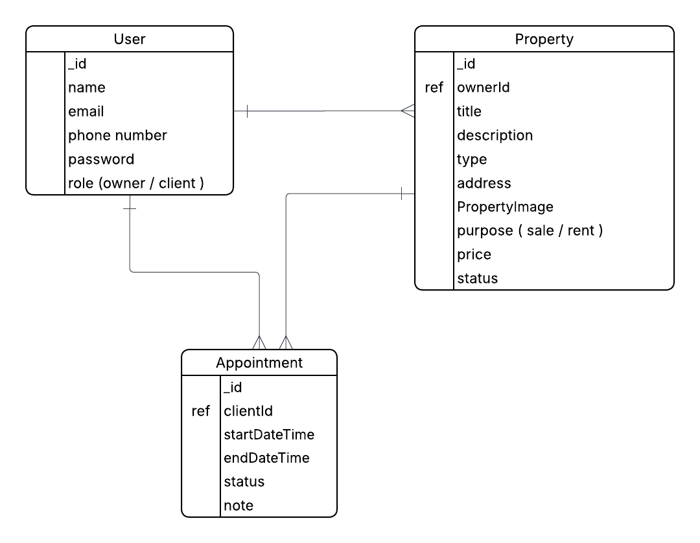

# Project 2 : EstateHub

## Date: 26/2/2026

### By: Maryam Altammam - Zainab Salman

[GitHub](https://github.com/imryms)
[LinkedIn](https://www.linkedin.com/in/maryam-altammam/)
***
[Github](https://github.com/ZELDA3)
[Linkedin](https://www.linkedin.com/in/zainab-salman-832213179?utm_source=share&utm_campaign=share_via&utm_content=profile&utm_medium=android_app)
[instagram](https://www.instagram.com/zainab.salman.380_?igsh=MWtqdTF0aXh2ZjJ5Ng==)
***

### ***Description***
#### This is a duo project it's a website for buying and selling properties. There are two types of users: an owner, who creates the listings of properties , and a client, who requests information. Based on their selections, the client has the option to pick, delete, or update appointments, as well as view the properties they have saved.
***

### ***Technologies Used***
* Node
* Express
* EJS
* MongoDB
***

### ***Getting Started***

##### When visiting the website, any person can view it as a guest. They will see the landing page, which includes a navigation bar for Home, Browse, Log In, and Register. However, to pick an appointment for visiting the site, they need to sign up or log in as a registered user. Once logged in, they can access the different sections of the website.
##### A Trello board was used to keep track of development progress and can be viewed [here](https://trello.com/invite/b/69a006ae8a3cc03b2d643fa0/ATTI9da3a134643a9f8a88ee1663a02d9af3AD4FB79E/project-2).
##### The project Wireframe [here](https://www.figma.com/design/g8SFkUtXf5uk8j2oG0rDnV/EstateHub?node-id=0-1&t=JF4WQQyDL2GDva10-1).

***

### ***Screenshots***

##### ERD

### ***Future Updates***

- [ ] Future Update 1
- [ ] Future Update 2
- [x] Completed Update
- [x] ~~Strikethrough~~ Items Also
***

### ***Credits***

##### Markdown Guide: [ia.net](https://ia.net/writer/support/general/markdown-guide)

##### Markdown Cheatsheet: [GitHub](https://guides.github.com/pdfs/markdown-cheatsheet-online.pdf)
***
